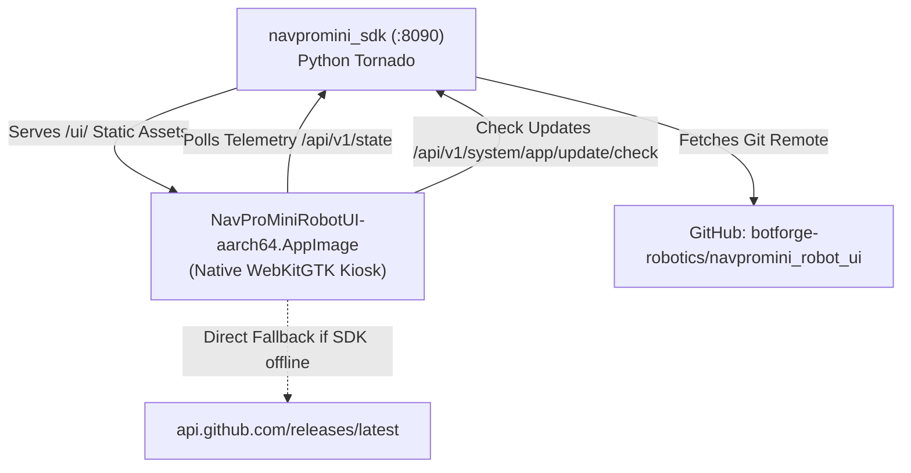

# NavPro Mini Robot UI — OTA Update & Release Guide

This document defines the release lifecycle, branch strategy, update mechanisms, and deployment workflows for the **NavPro Mini Robot Touchscreen UI** (`navpromini_robot_ui`).

---

## 1. System Architecture

The Robot Touchscreen UI runs locally on the robot companion computer (Raspberry Pi 5) in a fullscreen, portrait kiosk window:



- **Static Asset Server**: The Tornado HTTP server in `navpromini_sdk` binds to `http://127.0.0.1:8090` and serves the web UI at `/ui/` directly from `/home/navpromini/navpromini_robot_ui`.
- **Kiosk Runner**: `start_robot_screen.sh` rotates the display to portrait left (800x1280), sets touch coordinates, waits for the SDK to be reachable on port 8090, and launches the borderless fullscreen kiosk AppImage.

---

## 2. Branch Model & Update Channels

| Branch | Role | Intended Audience | Default Channel |
|---|---|---|:---:|
| **`main`** | **Production Release** | All deployed physical robots | **Yes** |
| **`dev`** | **Development / Staging** | Active development & lab testing | No |

### Update Channels
The UI settings modal provides an **Update Channel** selector:
- **`main` (Default)**: Tracks stable production releases from `origin/main`.
- **`dev`**: Tracks staging/preview builds from `origin/dev`.
- The user's selection is persisted in `localStorage` under `navpro_ui_update_channel`.

---

## 3. How Updates Work

### Automated Check & Notification
1. **Periodic Background Check**: `js/settings.js` polls for updates on startup and periodically.
2. **Session Dismissal**: If a user taps "Remind Me Later", the modal is suppressed for the current operating session (`sessionStorage.navpro_ui_update_dismissed = "true"`) and reappears only after the next reboot or kiosk restart.
3. **SemVer Comparison**: `compareSemVer(remoteVersion, APP_CURRENT_VERSION)` evaluates whether an update is newer.
4. **Hot Reload / In-Place Restart**: When the update is applied via the SDK updater, the webview reloads or restarts the kiosk process seamlessly.

---

## 4. Standard Workflow for Releasing Future Updates

Follow these exact steps when introducing new features or fixes to ensure stability:

### Step 1: Develop and Test on `dev`
Always develop on the `dev` branch:
```bash
git checkout dev
# make edits, test locally or on test bench
git commit -m "feat/fix: description"
git push origin dev
```

### Step 2: Bump the Version Number
Update `APP_CURRENT_VERSION` in `js/settings.js`:
```javascript
const APP_CURRENT_VERSION = "2.X.Y";
```
Commit the bump:
```bash
git add js/settings.js
git commit -m "chore(release): bump robot UI version to 2.X.Y"
git push origin dev
```

### Step 3: Fast-Forward Merge to `main`
Once tested and verified, fast-forward merge `dev` into `main` without creating merge commits:
```bash
git checkout main
git merge --ff-only dev
git push origin main
```

### Step 4: Tag and Publish GitHub Release
Tag the new release with SemVer:
```bash
git tag -a v2.X.Y -m "Release v2.X.Y - Summary of changes"
git push origin v2.X.Y
gh release create v2.X.Y --title "NavPro Mini Robot UI v2.X.Y" --generate-notes
```

### Step 5: Update the Robot
On the physical robot, pull the latest release from `main`:
```bash
ssh navpromini@<robot-ip> "cd /home/navpromini/navpromini_robot_ui && git checkout main && git pull --ff-only origin main"
```
*(Or let the robot automatically apply it via the Settings -> Software Updates touch interface!)*

---

## 5. Critical Guidelines & Safeguards

> [!WARNING]
> **Never spawn a competing HTTP server on port 8090 on the physical robot.**
> `start_robot_screen.sh` must ALWAYS wait for `navpro-sdk.service` to bind port 8090. If an ad-hoc `python3 -m http.server 8090` runs, it will block the SDK daemon from starting, breaking telemetry, battery reporting, and motor controls.

> [!TIP]
> Keep `main` and `dev` linear. Always prefer fast-forward merges (`git merge --ff-only dev`) from `dev` to `main` to preserve a clean, deterministic history.
